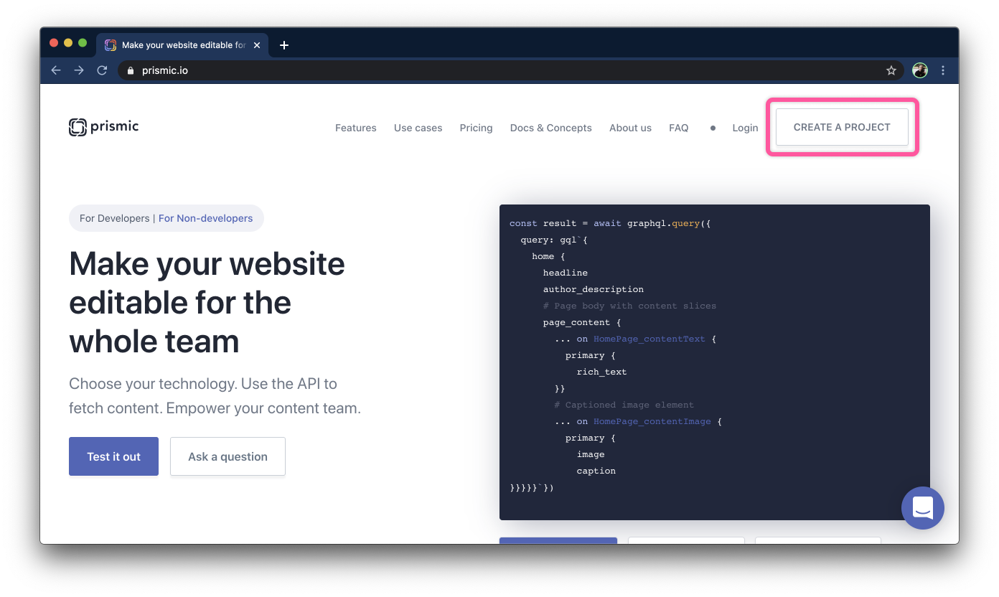
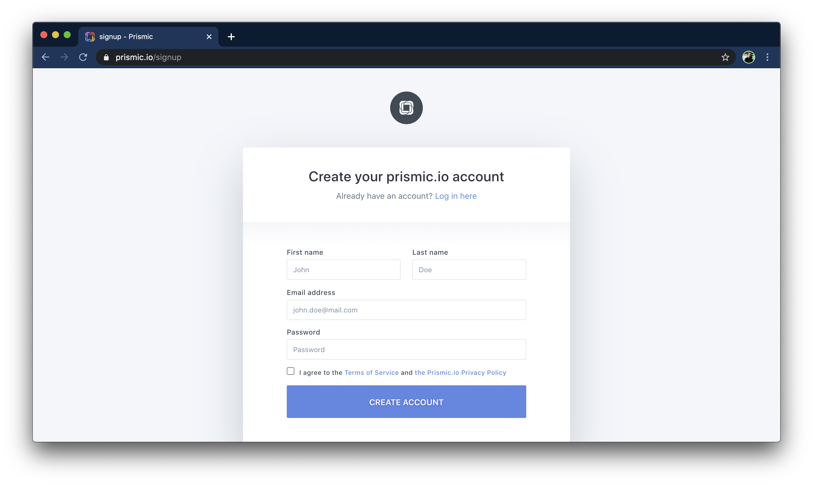
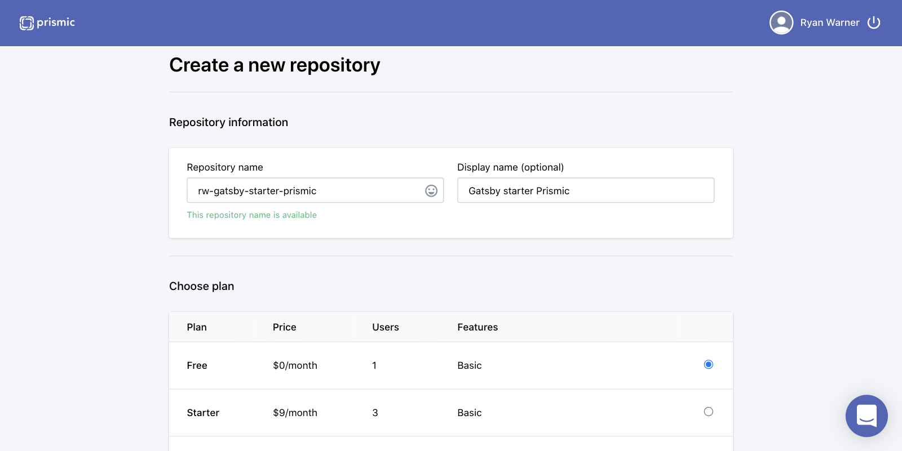
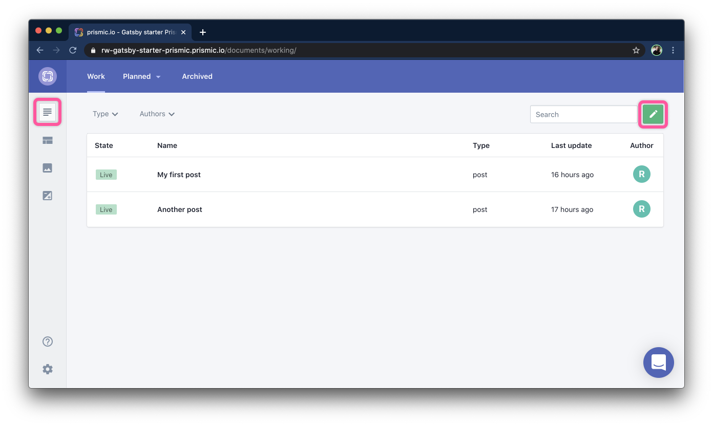
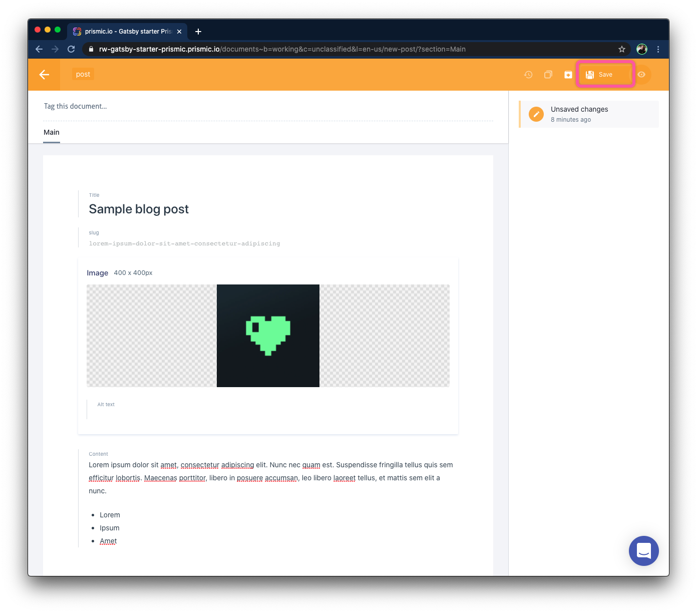
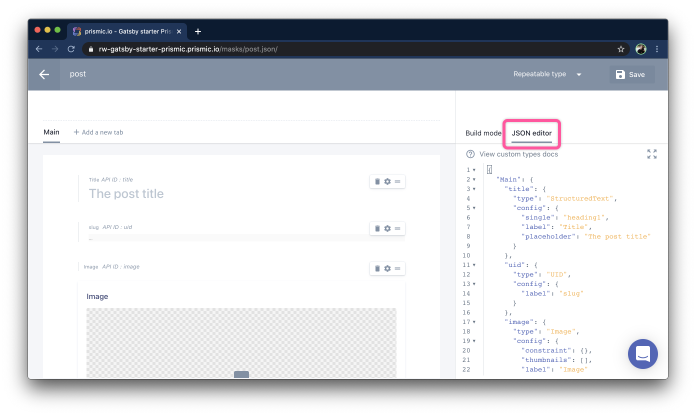
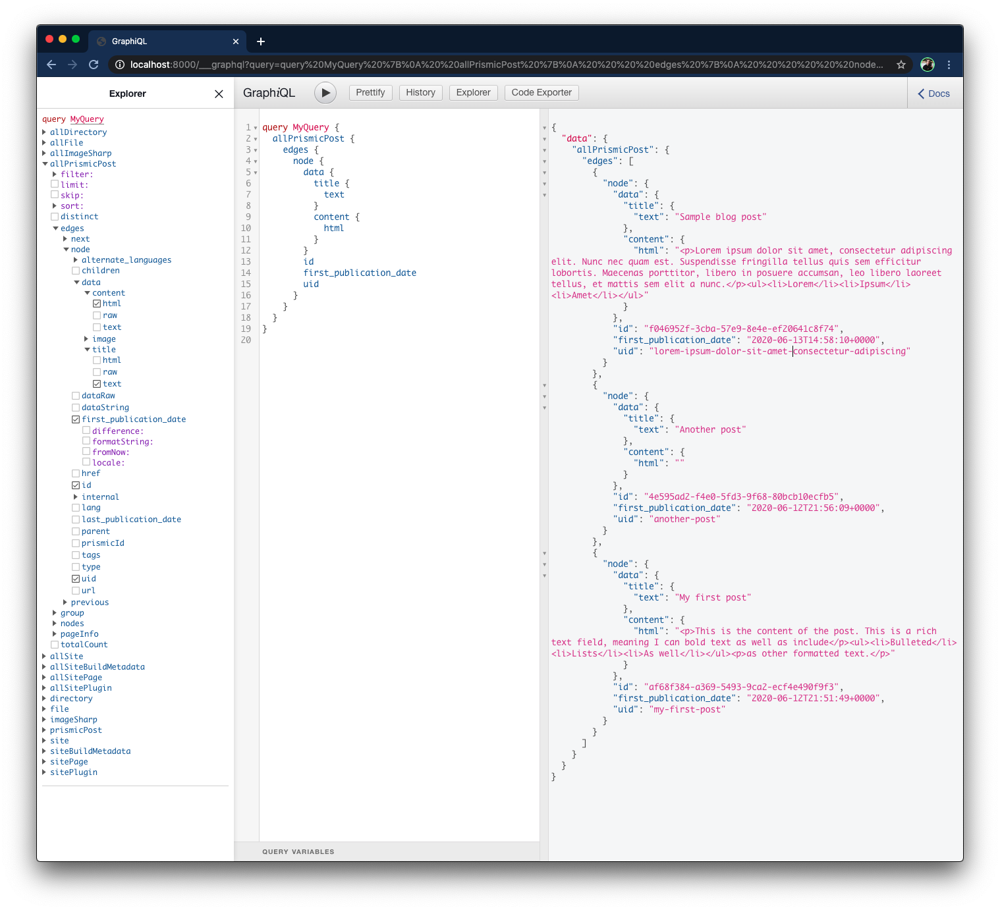

import AddPlugin from './diffs/AddPlugin'
import CreatePages from './diffs/CreatePages'

## Getting started with Prismic

[Prismic](https://prismic.io/) is a headless content management system. In this tutorial, we'll create a Prismic account with some sample blog posts and integrate the post content into a brand new Gatsby site.

### Create a Prismic account

The first step is to create a Prismic account. Navigate to [prismic.io](https://prismic.io/) and click "Create a Project" in the top right.



Fill out the sign up form and click "Create Account".




### Create a new repository

A Prismic repository is where your content will be stored. Click "Create repository" in the top right.



Choose a unique repository name, select your plan (I'm using the single user free plan) and click "Create this repository" at the bottom.

## Create a custom type

Create a custom, repeatable type called "post". This defines the type of content our post will contain.

Drag and drop content types from the left. FOr our example blog posts, we'll add the following types:

  - Title
  - Slug
  - Image
  - Rich text

## Create some sample post content



Select the content tab in the top left, then click the green pencil icon in the top right to create a new post.



Fill out the post with some sample content, then click the "Save" button in the top right. The save button should now become "Publish" — click this to make the content live.


## Create a new Gatsby site

Install the Gatsby CLI and use it to initialize a new Gatsby site with the [default starter](https://github.com/gatsbyjs/gatsby-starter-default). These steps are adapted from the official [Gatsby Quick Start](https://www.gatsbyjs.org/docs/quick-start).

```bash
npm install -g gatsby-cli
gatsby new gatsby-site
cd gatsby-site
npm start
```

You should see the site running at [`localhost:8000`](http://localhost:8000).

## Set up gatsby-source-prismic

[Read my reasoning behind choosing this package](/why-gatsby-source-prismic).

The following instructions are adapted and simplified version of the [official documentation](https://github.com/angeloashmore/gatsby-source-prismic).

Install the package.

`npm install --save gatsby-source-prismic`

[0564785](https://github.com/RyanWarner/gatsby-starter-prismic/commit/0564785d0e83d230cedb44a332cc6ea4500cc572)

Add the plugin to your Gatsby plugins array.

<AddPlugin />

[bbd02f2](https://github.com/RyanWarner/gatsby-starter-prismic/commit/bbd02f21238fdaf18892ffb399157fd4edc5039c)

There are a lot of other options available (see the full list [in the docs](https://github.com/angeloashmore/gatsby-source-prismic#how-to-use)) but we're going to start simple.

The schema definition does not yet exist in our code base. To add this, create the file `src/schemas/post.json`.

Grab the JSON genereted by Prismic by navigating to your custom `post` type, and then click on the "JSON editor" tab on the right.



Copy and paste this JSON into your `src/schemas/post.json` file.

Restart your development server.

## View your Prismic content in the GraphQL explorer

Open the GraphQL explorer ([http://localhost:8000/___graphq](http://localhost:8000/___graphql) to see your Prismic post content! Expand `allPrismicPost → edges → data → title → text` and press the Execute Query (play) button (CTRL + Enter) to see the post content you entered in the Prismic UI.

We'll also want some other data such as the `id`, `uid`, and `content`.



## Create pages from Prismic data

Now that we're getting our content from the Prismic API, we want to use this content to create pages on our site.

Using the Gatsby docs on [createPages](https://www.gatsbyjs.org/docs/node-apis/#createPages) as well as the [example](https://github.com/angeloashmore/gatsby-source-prismic#sites-gatsby-nodejs-example) given in the `gatsby-source-prismic` readme as reference, let's create pages from our Prismic posts.

<CreatePages />

[23a2694](https://github.com/RyanWarner/gatsby-starter-prismic/commit/23a2694c590535ba866702d6d6d742ff4d782519)

Write a GraphQL query to get our post data from Prismic (this is the same query we constructed in the GraphQL explorer).

We'll then loop through each post and call `createPage` passing in the `uid` as our path, a component (we'll create this in the next step), as well as the Prisimic data as context.

## Display post content

Create a new component file, `src/components/PostTemplate/PostTemplate.js`.

```jsx
import React from "react"

const PostLayout = props => {
  return (
    <>
      <h1>{props.pageContext.data.title.text}</h1>
      <div
        dangerouslySetInnerHTML={
          { __html: props.pageContext.data.content.html }
        }
      />
    </>
  )
}

export default PostLayout
```

This is the component we passed to `createPages` in the previous step. This component renders the Prismic data we passed in as `pageContext` in `gatsby-node.js`.

Navigate to your post in the browser (in my case, [`http://localhost:8000/my-first-post`](http://localhost:8000/sample-blog-post)) to see your post content!

## Conclusion

We started by creating a Prismic account and creating a custom repeatable type called "post". We then initialized a new Gatsby site, and added the `gatsby-source-prismic` plugin. Lastly, we created pages and rendered the blog post content.

## Next steps

There's a lot more functionality we could add or explore. Continuous Deployment, Prismic slices, images, and previews are all important features that I will explore in future posts.
