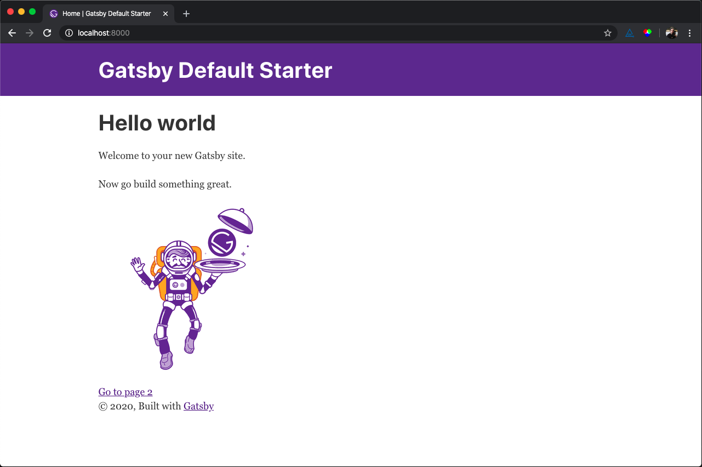
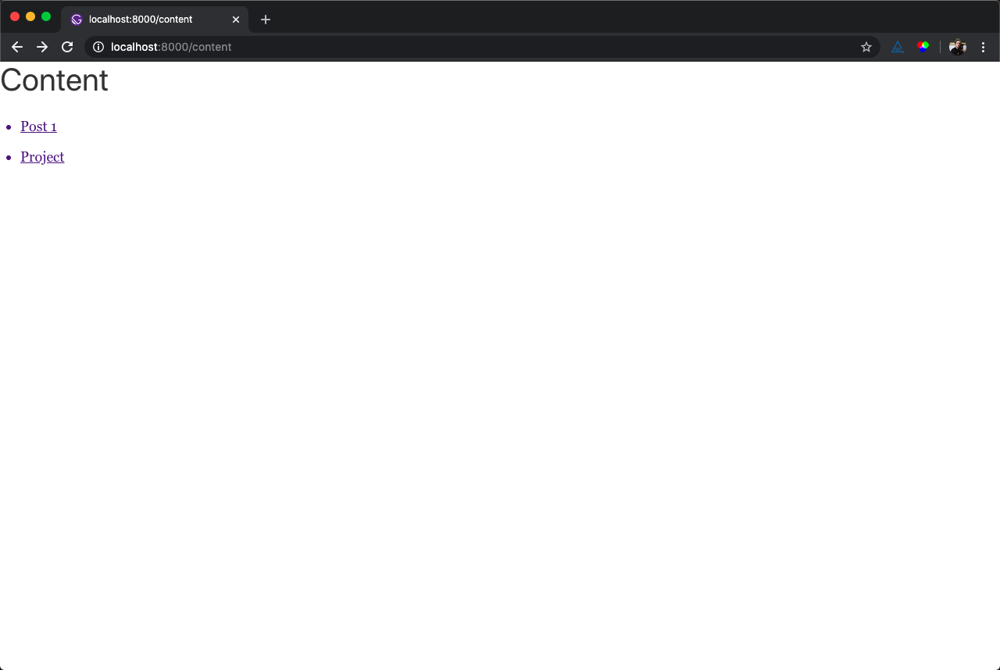

import { DiffViewer } from 'components'
import ContentDiff from './Diffs/ContentDiff'
import MdxPluginDiff from './Diffs/MdxPluginDiff'
import NewMdxPage from './Diffs/NewMdxPage'
import AddGraphql from './Diffs/AddGraphql'
import GraphqlSlug from './Diffs/GraphqlSlug'
import ContentSource from './Diffs/ContentSource'
import OnCreateNode from './Diffs/OnCreateNode'
import CreateContentPage from './Diffs/CreateContentPage'
import GatsbyConfigPages from './Diffs/GatsbyConfigPages'
import MdxTestPage from './Diffs/MdxTestPage'

Gatsby is a static site generator built on React that provides a delightful developer experience. Using Gatsby with MDX allows us to create rich content using familiar, readable syntax stored right in our source code.

## Initializing a new, default Gatsby site

Install the Gatsby CLI and use it to initialize a new Gatsby site with the [default starter](https://github.com/gatsbyjs/gatsby-starter-default). These steps are adapted from the official [Gatsby Quick Start](https://www.gatsbyjs.org/docs/quick-start).

```bash
npm install -g gatsby-cli
gatsby new gatsby-site
cd gatsby-site
npm start
```

You should see the site running at [`localhost:8000`](http://localhost:8000).



Let's get familiar with the project structure by making a small change. Open the project in your code editor, and navigate to `src/pages/index.js`. Change the `<h1>` text to something else, like "Hello world". Save, and observe your changes in the browser.

[7f49e8d](https://github.com/RyanWarner/gatsby-starter-mdx-theme-ui/commit/7f49e8d91b100745e62575d8547e3606aa5ea398)

## Adding MDX support

"MDX is an authorable format that lets you seamlessly write JSX in your Markdown documents." — [mdxjs.com](https://mdxjs.com/)

To add MDX support, we will follow the steps detailed in [gatsby-plugin-mdx](https://www.gatsbyjs.org/packages/gatsby-plugin-mdx/#installation). I've pulled them out below for convenience.

```bash
npm install --save gatsby-plugin-mdx @mdx-js/mdx @mdx-js/react
```

Add ``gatsby-plugin-mdx`` to the plugins array found in `gatsby-config.js`.

<MdxPluginDiff />

[04b5d73](https://github.com/RyanWarner/gatsby-starter-mdx-theme-ui/commit/04b5d732efb43fabf5297ec14032af94a155070e)

You can now create MDX pages. To test this out, create a new MDX file, `page-3.mdx` inside the pages directory with some markdown. With the power of MDX, you could also add your own React components right next to your markdown.

<MdxTestPage />

Restart your server (`CTRL+C` then `npm start`) and navigate to [http://localhost:8000/page-3](http://localhost:8000/page-2) to observe the MDX page working.

[eb52289](https://github.com/RyanWarner/gatsby-starter-mdx-theme-ui/commit/eb52289b564d550d4107673d779aeda91a8974e8)

## Create pages from content

Next we'll add a feature to create pages or routes from files outside of the pages directory. In this example, we will create pages from a new directory, `content`. Every file inside the `content/` directory will be its own page.

First, install [gatsby-plugin-page-creator](https://www.gatsbyjs.org/packages/gatsby-plugin-page-creator/). We'll use this to automatically create pages from React components in directories of our choosing.

```
npm install --save gatsby-plugin-page-creator
```

Configure the plugin to create pages from files within `src/content/`.

<GatsbyConfigPages />

Now create the `src/content/` directory and add an MDX file with some [frontmatter](https://www.gatsbyjs.org/docs/adding-markdown-pages/#frontmatter-for-metadata-in-markdown-files).

<NewMdxPage />

Restart your server and navigate to [localhost:8000/post](http://localhost:8000/post) to see it working.

This also works with nested directories. If you create the file `src/content/case-studies/projects.mdx`, Gatsby will create a page at [localhost:8000/case-studies/project](http://localhost:8000/case-studies/project)

[599d27d](https://github.com/RyanWarner/gatsby-starter-mdx-theme-ui/commit/599d27d736e520a2a38e17fae15958f1a1274924)

## Display content in your components

We're now creating pages from MDX files within the content directory (and sub-directories)! 🎉

However, we don't have a way to interact with those pages from our components. Adding this feature is useful for creating things like a list of recent blog posts.

We'll use [gatsby-source-filesystem](https://www.gatsbyjs.org/pac[kages/gatsby-source-filesystem/) to provide our application with data about our files, and a [Gatsby Page Query](https://www.gatsbyjs.org/docs/page-query/) to provide data to our component.

First, let's tell our Gatsby app about the content folder by adding this object to our plugins array:

<ContentSource />

Next, create a new page, `content.js`. We'll use this to display a list of all of our content pages.

<CreateContentPage />

To supply this component with information about our MDX content, we need to create a [page query](https://www.gatsbyjs.org/docs/page-query/). Gatsby automatically looks for a single exported `graphql` string in page components and passes the result of the GraphQL query to your component as a prop named `data`.

<AddGraphql />

Restart your development server, and observe the output of the console log. We use this data to render a list of content pages.

[6b03abf](https://github.com/RyanWarner/gatsby-starter-mdx-theme-ui/commit/6b03abf75a53e39acabdbfeedcbeea4d0bd82d1e)

## Add links to your content pages

During the Gatsby build process, we need to add some extra data to each MDX node, specifically the slug used for the URL. This will eventually get passed to our component and used to link to each page.

We'll hook in to the [onCreateNode](https://www.gatsbyjs.org/docs/node-apis/#onCreateNode) API and add a field called `slug` to each MDX node.

<OnCreateNode />

Now that each MDX node has its own slug, update the GraphQL page query with the slug field.

<GraphqlSlug />

With this new data, update the content component to include a link to each page.

<ContentDiff />

[af6558a](https://github.com/RyanWarner/gatsby-starter-mdx-theme-ui/commit/af6558a7ec303ceb1b6a50aa989229b0f8702b0c)

Restart your server, and try it out! Here's how mine turned out.



## Conclusion

You now have the ground work laid for an MDX powered Gatsby site. By configuring Gatsby to create pages out of your MDX files, and then rendering that content in your components, you have a powerful starting point for creating amazing content.

Thank you [Tony](https://twitter.com/3_Alves) and [Prince](https://prince.dev) for proofreading and encouraging me.
